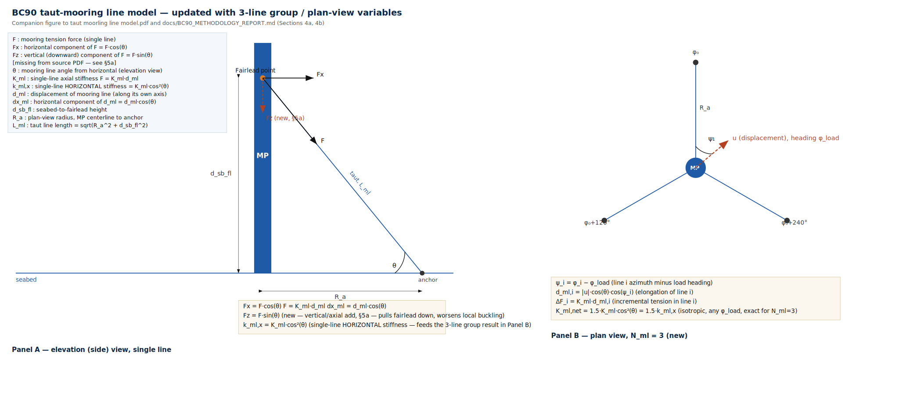

# BC90 Concept Design Methodology — Taut-Mooring-Supported Monopile (60–90 m)

BC90 extends the MP tool (`docs/METHODOLOGY_REPORT.md`, "baseline" below) with
a taut-mooring option for a bottom-founded monopile in 60–90 m water depth.
Scope/brief: `Extend_MP_BC90.md`. Mooring free-body source: `taut moorling
line model.pdf` (single-line, 2D, elevation-view only).

**Implementation status.** This methodology is implemented additively in
`bc90/mooring.py` (single-line and 3-line stiffness, flexibility kernel,
redundant-force solve, NFA correction) and `bc90/engine_bc90.py`
(`evaluate_bc90`, the BC90 analog of `engine.py`'s `evaluate_monopile`), plus
`bc90/compare_mp_vs_bc90.py`, `bc90/optimize_mooring_grid.py`,
`bc90/test_mooring.py`, `bc90/test_engine_bc90.py`. These import `engine.py`'s
turbine/load/soil/ULS/SLS/FLS/buckling functions unchanged. **`engine.py` and
`app.py` themselves are not modified.** Equations below are cross-checked
against `bc90/*.py` and match it; where noted, the code implements a specific
choice this document flags as a modeling decision.

**Section numbering.** Follows baseline numbering (`0`…`11`), with two sets of
BC90-only subsections: `4a`/`4b`/`4c` (mooring model — needed because the brief
asserts §5's load-reduction form without deriving the mooring reaction that
feeds it) and `9a` (initial mooring layout). This mirrors, but is not
identical to, `Extend_MP_BC90.md`'s own section list (`0,1,2,3,4,5,5a,6,7,8,9`,
plus its own `9a`) — the brief does not itself contain `4a/4b/4c` or
baseline's `10`/`11`, both of which this document retains. The Symbol
glossary, Note, and References are unnumbered front/back matter, as in the
baseline.

---

## 0. Process overview

Baseline flow (§0) is unchanged in outer shape (turbine lookup → initial
geometry guess → evaluate → iterate). BC90 inserts new steps between the
baseline's soil-stiffness step and its ULS/SLS/NFA/FLS/buckling step, and adds
a mooring-only check:

1. Turbine lookup (§2, unchanged).
2. Initial geometry guess (§9, unchanged) **and** initial mooring layout guess
   (§9a: `d_sb_fl`, `R_a`, `θ`, `K_ml`, `T0`).
3. Mudline extreme loads `M_char`, `V_char` (§3, unchanged, evaluated at
   greater water depth).
4. Soil stiffness `K_L`, `K_R` (§4, unchanged).
5. Single-line and 3-line mooring stiffness (§4a, §4b).
6. Solve the redundant-force problem for `F_ml`; derive `M_char_net`,
   `V_char_net`, `M_fl` (§4c).
7. ULS at mudline and fairlead (§5), buckling with an added axial term (§5a),
   SLS (§6), NFA with corrected stiffness (§7), FLS (§8) — plus mooring-line
   ULS and a slack/minimum-tension check (§9a). Seven utilizations total
   (`ULS`, `SLS`, `NFA`, `FLS`, `Buckling`, `Slack`, and `MooringULS` once a
   real line/MBL is selected).
8. If any utilization fails: adjust pile geometry (§9) or mooring parameters
   (§9a).
9. Report: diameter, thickness, embedded length, mooring layout/specs
   (`N_ml=3`, `R_a`, `d_sb_fl`, `θ`, `L_ml`, `K_ml`, `T0`, required `MBL`),
   steel mass/cost, mooring system cost, total CAPEX.

**Coupling and what's implemented.** Steps 5–6 couple the pile-sizing loop and
the mooring-sizing loop: mooring stiffness changes `M_char_net`/`V_char_net`/
axial load, which changes converged `D`/`t`, which changes `K_L`/`K_R`, `EI`,
and hence the flexibility terms `F_ml` itself depends on. This document treats
them as **two nested loops** (outer: pile geometry; inner: mooring
reaction/utilization for the current geometry) rather than one joint
optimization:

- **Outer loop — implemented.** `shrink_geometry_with_mooring` greedily
  shrinks diameter then wall thickness, mooring layout held fixed, stopping at
  the first geometry that fails any of the seven checks. Growth (the failing
  direction) is not implemented for BC90, mirroring the baseline's own
  asymmetry.
- **Inner loop (mooring-parameter sizing, §9a) — not auto-converging.**
  `optimize_mooring_grid.py` sweeps a fixed grid of `(R_a, d_sb_fl)` with
  `MBL`/`EA` held constant and `T0` set by a rule (§9a), re-running the outer
  shrink loop at each grid point. This operationalizes the nested-loop
  concept but is a grid sweep, not a gradient or auto-converging joint
  optimizer.

---

## Symbol glossary (BC90 additions)

Adds to, not replaces, the baseline glossary. Units follow the same MN-based
convention (baseline §0).



*Panel A: single-line elevation (§4a). Panel B: 3-line plan view (§4b). Panel
C: pile as a beam with two elastic supports — foundation spring at mudline,
mooring spring at fairlead (§4c).*

**Mooring geometry & line properties**
| Symbol | Meaning | Units |
|---|---|---|
| `N_ml` | number of mooring lines — fixed at 3 per scope | – |
| `d_sb_fl` | fairlead height above seabed/mudline (design variable) | m |
| `R_a` | mooring footprint radius, MP centerline to anchor, plan view (design variable) | m |
| `φ_i` | azimuth of line `i` (`i=1..3`), equally spaced 120° apart (§4b) | deg |
| `θ` | line angle from horizontal, `atan(d_sb_fl / R_a)`, identical for all 3 lines | rad |
| `L_ml` | taut line length, `sqrt(R_a² + d_sb_fl²)` | m |
| `EA_ml` | line axial rigidity, `K_ml = EA_ml / L_ml` (§9a) | MN |
| `K_ml` | single-line axial stiffness, `F = K_ml·d_ml` | MN/m |
| `d_ml` | line elongation from the pretensioned length | m |
| `F`, `Fx`, `Fz` | line tension; horizontal component `F·cosθ`; vertical component `F·sinθ` (**not** in the source PDF — §5a) | MN |
| `T0` | single-line pretension at the neutral (undisplaced) position (design variable) | MN |
| `ΔF_i` | incremental tension in line `i` from fairlead displacement | MN |
| `T_i = T0 + ΔF_i` | total tension in line `i` | MN |
| `T_max`, `T_min` | max/min single-line tension over the design load case | MN |
| `MBL` | line minimum breaking load (input) | MN |
| `γ_ml` | mooring-line ULS partial factor (§1, §5) | – |

**Group (net) mooring stiffness / force**
| Symbol | Meaning | Units |
|---|---|---|
| `k_ml,x` | single-line horizontal (projected) stiffness, `K_ml·cos²θ` | MN/m |
| `K_ml,net` | net isotropic horizontal stiffness of the 3-line group at the fairlead (§4b) | MN/m |
| `F_ml` | net horizontal reaction from the 3-line group at the fairlead (the "redundant force," §4c) | MN |
| `a` | height above mudline at which the flexibility kernel `f(a,b)` is evaluated for the fairlead, `a ≡ d_sb_fl` | m |
| `f(a,b)` | lateral displacement at height `a` from a unit horizontal force at height `b` (§4c) | m/MN |
| `f_aa` | `f(a,a)`, self-flexibility at the fairlead | m/MN |
| `δ_fl,0` | fairlead displacement from environmental loads alone (mooring removed) | m |
| `z_wave_eq` | equivalent height of the resultant wave+current load, `M_wave / F_wave` | m |
| `M_char_net`, `V_char_net` | mudline design moment/shear after netting out the mooring reaction — replaces `M_char`/`V_char` as the ULS/SLS/FLS input | MN·m, MN |
| `M_fl` | bending moment at the fairlead cross-section — a new potential critical section (§4c, §5) | MN·m |

---

## 1. Constants

New constants alongside the unchanged baseline set (baseline §1):

| Constant | Value in `bc90/engine_bc90.py` | Status |
|---|---|---|
| `N_ML` | 3 | Fixed by scope, not free |
| `GAMMA_ML_ULS` | 1.75 | **Open modeling decision** — see below |
| `T_MIN_FRACTION` | 0.05 | Unsourced placeholder — genuine gap |
| `USD_PER_M_MOORING_LINE` | $500/m flat | Sourced alternative exists (polyester) — see below |
| `USD_PER_ANCHOR` | $250,000/anchor flat | Order-of-magnitude consistent with a derived estimate — see below |

**`GAMMA_ML_ULS` — which consequence class, not which number.** DNV-OS-E301
(Oct 2008) Table D1 gives a **quasi-static** ULS partial factor (one factor on
total tension, matching BC90's `γ·T_max` form) of **1.70** for Consequence
Class 1 or **2.50** for Class 2, further ×**1.2** if the system is judged
non-redundant (§D203). `1.75` sits just above the CC1 value and is defensible
only under "CC1 + redundant (3-line) system" — not under CC2 or
non-redundancy, either of which would require 2.04–3.0. **The undecided item
is which consequence class/redundancy classification applies to a BC90
mooring assist** — tied to the §5 "redundant assist vs. load-bearing"
philosophy question, not yet made. Source: `docs/mooring_line_database.md` §8
(DNV-OS-E301 read directly).

**`T_MIN_FRACTION` — genuine unsourced gap.** DNV-OS-E301 requires lines not
to go slack (§D801) but gives no numeric minimum-tension fraction of
`T0`/`MBL`; none was found elsewhere either (`docs/mooring_line_database.md`
§1, §8). Remains a placeholder.

**`USD_PER_M_MOORING_LINE` — sourced for polyester, current constant not
representative.** Striani et al. (2025), Eq. 2:
```
cost_per_m [EUR/m] = 13.8 * MBL_MN + 11.281
```
At a typical `MBL ≈ 15 MN` this gives ≈€218/m (≈$236/m), well under the flat
$500/m, and — unlike the flat constant — scales with `MBL`. Context gap: this
correlation comes from floating-wind shared-mooring cost modeling (a
DTOcean+-style model), not a BC90-specific bottom-founded application.
Recommend replacing the flat constant with this formula in a future code
change (out of scope here — methodology only). Source:
`docs/mooring_line_database.md` §2, §10a.

**`USD_PER_ANCHOR` — order-of-magnitude consistent, but derived not primary.**
BVG Associates' aggregate 1 GW floating-wind anchor cost (≈£35M) implies
≈$221,000/anchor under assumptions not in the source (67×15 MW turbines, 3
anchors/turbine, ~1.27 USD/GBP) — close to $250,000, but priced for a
floating-wind drag anchor sized for full station-keeping, not a BC90 assist
anchor. Treat the closeness as coincidental. Source:
`docs/mooring_line_database.md` §7, §10.

---

## 2. Turbine library

**Unchanged** (baseline §2). 60–90 m depth is outside every sourced reference
design in the library (OC3 5 MW @ 20 m, IEA 15/22 MW @ 34–35 m); BC90's depth
range makes the 22/25 MW rows — the least-verified entries (baseline §2,
25 MW is an unverified linear extrapolation) — the most likely to be
exercised. `d_sb_fl`, `R_a`, `K_ml`, `T0` are mooring/site inputs, analogous to
`SoilProfile`, not turbine-library fields.

---

## 3. Extreme mudline loads

**Unchanged equations** (baseline §3): `M_char`, `V_char` from drag-only
Morison wave load plus point wind thrust, evaluated at the larger
`water_depth_m`. `M_char`/`V_char` remain pre-mooring; the mooring reaction is
netted out separately in §4c.

Deeper water makes existing baseline caveats more consequential without
changing the equations: `H_max = 1.9·Hs` scales a larger `F_wave`/`M_wave`;
omitting the Morison inertia term is less defensible for a large-diameter pile
in deep water (inertia ~`D²`, drag ~`D`); marine growth over a taller
submerged shaft is unmodeled. No new equation proposed.

---

## 4. Soil stiffness

**Unchanged** (baseline §4): Hetenyi closed-form `K_L`/`K_R` depend only on
`D`, `L`, `EI`, soil profile — mooring does not touch the soil.

Indirect coupling: if mooring enables a smaller converged `D`/`L`, the
`β·L < 2.5` validity flag (baseline §4) is *more* likely to trip, and the
baseline's own finding that embedded length has no capacity-driven growth
mechanism (baseline §9/§11 item 21) becomes more consequential for a
mooring-assisted, potentially under-embedded pile. No new equation.

---

## 4a. Single mooring line model

From `taut moorling line model.pdf` (single line, 2D elevation view):
```
F      = K_ml * d_ml              (line tension, linear stiffness)
Fx     = F * cos(θ)                (horizontal component)
dx_ml  = d_ml * cos(θ)             (horizontal component of elongation)
```
**Linearization (derived, not in the PDF):** for a small horizontal fairlead
displacement `dx`, the elongation is the projection of `dx` onto the line
axis, `d_ml = dx·cos(θ)`. Combining with the two relations above gives the
single-line horizontal projected stiffness:
```
k_ml,x = Fx / dx = K_ml * cos²(θ)
```
This is the standard taut-mooring/TLP-tendon restoring-stiffness form
(`(EA/L)·cos²θ`); a literature search did not find one canonical citation to
quote, so treat it as derived from the PDF's own two relations, not a
verbatim standard.

**Vertical component (missing from the source PDF):**
```
Fz = F * sin(θ)
```
The PDF's FBD labels only `Fx`. `Fz` pulls the fairlead down, adding axial
compression above mudline — this is what answers the brief's §5a question
("how does mooring affect buckling?"); see §5a.

---

## 4b. Three-line group stiffness

**Layout assumption (not specified by the brief):** 3 lines equally spaced at
120° (`φ_i = φ_0, φ_0+120°, φ_0+240°`), identical `K_ml`, `θ`, `T0` — the
natural choice for a monopile that must resist loads from an arbitrary
heading.

**Derivation.** For a fairlead displacement `u` at heading `φ_load`, line
`i`'s elongation (projecting `u` onto the line's horizontal-plane direction)
is:
```
d_ml,i = |u| * cos(θ) * cos(φ_i - φ_load)
ΔF_i   = K_ml * d_ml,i
```
Each line contributes a horizontal restoring-force matrix term
`K_ml·cos²θ·(e_i⊗e_i)`, `e_i = (cos φ_i, sin φ_i)`. For 3 equally-spaced
lines:
```
Σ cos²(φ_i - φ_load)               = 3/2   (exact, any φ_load)
Σ cos(φ_i-φ_load)·sin(φ_i-φ_load)  = 0     (exact, any φ_load)
```
(Summing `cos(2ψ_i)` over 3 angles 120° apart sums the real parts of the
three cube roots of unity — exactly zero, for any `N ≥ 3` equally-spaced
lines, not only `N=3`.) Net result — **isotropic**, independent of `φ_load`:
```
K_ml,net = 1.5 * K_ml * cos²(θ) = 1.5 * k_ml,x
```
The group stiffness does not cancel (0×) or triple (3×); it is exactly
1.5× the single-line horizontal stiffness, for any heading. This lets the
group be treated as one scalar spring in §4c/§7, consistent with the
baseline's own single-vertical-plane load treatment. Verified numerically in
`bc90/test_mooring.py::check_three_line_isotropy` (brute-force summation over
5 headings, matched to 1e-12).

**Not isotropic: individual line tension.** For a given heading, tension
redistributes unevenly among the 3 lines. The most-loaded line's tension
factor ranges from `K_ml·cosθ·dx` (heading aligned with a line) to
`0.5·K_ml·cosθ·dx` (heading bisecting two lines) — matters for the
heading-dependent mooring-line ULS/slack checks (§5, §9a), even though group
stiffness is heading-independent.

---

## 4c. Net mooring reaction and its effect on mudline design loads

The brief asserts `M_char` is "reduced by `Fx·d_sb_fl`" without deriving `Fx`
(here `F_ml`). This cannot be assumed: the pile+mooring system is **statically
indeterminate** (foundation spring at mudline, plus the mooring group as a
second elastic support at height `d_sb_fl`) — `F_ml` must be solved for.

**Force/flexibility (redundant-force) method**, reusing the baseline's own
Hetenyi `K_L`/`K_R` (§4) and cantilever flexibility (baseline §7), generalized
to two arbitrary heights `a`, `b` above mudline (`K_LM` omitted, exactly as in
baseline §7):
```
f(a,b) = 1/K_L + a*b/K_R + a²*(3b-a)/(6*EI_pile)      for a <= b
f_aa  := f(a,a) = 1/K_L + a²/K_R + a³/(3*EI_pile)
```
Symmetric in `a,b` (Maxwell–Betti); reduces exactly to the baseline's
`cantilever_flexibility + 1/K_L + h²/K_R` when `a=b=h`. Valid provided both
heights are within the pile's own `EI` (below the transition piece) —
`bc90/engine_bc90.py` flags a note if `d_sb_fl` exceeds
`pile_above_mudline = water_depth_m + transition_piece_height_m`.

**Step 1 — fairlead displacement from environmental loads alone**, using the
same two-point-load decomposition the baseline already makes implicitly
(`F_thrust` at `h = hub_height_m+water_depth_m`, `F_wave` at
`z_wave_eq = M_wave/F_wave`):
```
δ_fl,0 = F_thrust * f(a, h) + F_wave * f(a, z_wave_eq)          (a = d_sb_fl)
```
**Step 2 — solve for the redundant reaction** `F_ml` (`disp_fl = δ_fl,0 -
f_aa·F_ml`, `F_ml = K_ml,net·disp_fl`):
```
F_ml = K_ml,net * δ_fl,0 / (1 + K_ml,net * f_aa)
```
Limits verified in `bc90/test_mooring.py::check_mooring_reaction_limits`:
`F_ml → 0` as `K_ml,net → 0`; `F_ml → δ_fl,0/f_aa` (rigid-prop reaction) as
`K_ml,net → ∞`.

**Step 3 — net mudline design loads:**
```
M_char_net = M_char - F_ml * a
V_char_net = V_char - F_ml
```
Matches simple statics (cutting at mudline, the mooring reaction is another
applied force above the cut, moment arm `a`) — correct *given* `F_ml` from
Step 2, not because the brief derived it. **Not guaranteed positive**: if
`K_ml,net` is very large relative to foundation stiffness, classical
propped-cantilever behavior can reverse the base-reaction sign for some load
distributions; `evaluate_bc90` flags a note if `|M_char_net| ≥ |M_char|`.

**New critical section — the fairlead.** Because `F_ml` is a point force
above mudline, the moment diagram is not guaranteed maximal at mudline. The
fairlead-section moment (loads above the fairlead only, valid when
`a ≤ z_wave_eq`):
```
M_fl = M_char - a * V_char
```
**Required: check `max(|M_char_net|, |M_fl|)`**, not `M_char_net` alone —
missing from the brief, which implicitly assumes mudline always governs.

**Load-factor linearity caveat.** The system is linear-elastic only while no
line goes slack; `F_ml` at `GAMMA_F_ULS`-factored loads equals
`GAMMA_F_ULS × F_ml,char` **only if** slack is verified not to occur between
characteristic and factored load levels (§9a). If a leeward line slacks under
factored loads but not characteristic loads, this linear scaling
over-predicts `F_ml` and becomes non-conservative.

---

## 5. ULS check

**Governing equation unchanged** (baseline §5): `σ_vm =
sqrt(σ_bending² + 3·τ_shear²)`, checked against `STEEL_YIELD_MPA/GAMMA_M_ULS`.
Inputs and number of sections checked change:
```
M_uls,mudline   = GAMMA_F_ULS * M_char_net
V_uls,mudline   = GAMMA_F_ULS * V_char_net
M_uls,fairlead  = GAMMA_F_ULS * M_fl
V_uls,fairlead  = GAMMA_F_ULS * V_char        (NOT V_char_net — a cut immediately
                                                above the fairlead has not yet
                                                "seen" the mooring reaction)
```
Run `σ_vm` at **both** sections; governing = worse of the two
(`uls_utilization = max(uls_mudline, uls_fairlead)` in `evaluate_bc90`).
Section properties at the fairlead may differ from mudline if tapered —
out of scope for this constant-`D`/`t` concept model, same as baseline.

**Mooring-line ULS check (no baseline equivalent):**
```
disp_fl,char = δ_fl,0 - f_aa * F_ml                         (net char. fairlead displacement)
disp_fl,ULS  = GAMMA_F_ULS * disp_fl,char
T_max = T0 + K_ml * cos(θ) * |disp_fl,ULS| * cos(φ_worst)
utilization_MooringULS = γ_ml * T_max / MBL                 (if MBL supplied)
MBL_required            = γ_ml * T_max                      (if not)
```
`cos(φ_worst)` is the worst-heading single-line factor (§4b), 0.5–1.0;
`evaluate_bc90` defaults to the conservative 1.0 unless the layout is
deliberately oriented to a known dominant heading.

**Open philosophy question, not resolved here — an owner/certifier
decision:** unlike a TLP (tendon loss potentially catastrophic — tendons are
the entire station-keeping system), BC90's pile is independently
bottom-founded. Two philosophies:
1. **Mooring as redundant assist** — pile alone (or with one line failed)
   must still pass ULS/buckling; requires an ALS "mooring-line-loss" case
   (`F_ml=0` or 2-line group stiffness). **Not implemented**: `evaluate_bc90`
   assumes all 3 lines intact.
2. **Mooring as load-bearing, non-redundant** — pile explicitly sized with
   mooring present; requires line inspection/monitoring, DNV-OS-E301
   ALS/redundancy classification, and (per §1) the ×1.2 `GAMMA_ML_ULS`
   non-redundancy uplift.

The brief's "`M_char` reduced by `Fx·d_sb_fl`" framing implicitly assumes
philosophy (2) without saying so.

---

## 5a. Local shell buckling check

**The DNV-RP-C202 formula itself is unchanged** (baseline §5a), but a
required input changes: `axial_load_estimate`. From §4a, every taut line has
`Fz = F·sinθ`. To first order, the tension-redistribution terms `ΔF_i` cancel
across the 3 symmetric lines (§4b identity applied to the vertical direction,
which has no azimuthal dependence), so:
```
F_ml,vertical ≈ N_ml * T0 * sin(θ)                     (implemented: N_ml=3)
axial_load_estimate_BC90 = axial_load_estimate_baseline + F_ml,vertical
```
This raises `σ_axial`, hence `σ_vM` in the buckling check — **buckling
utilization rises because of mooring, even as bending/shear utilization
(via `M_char_net`/`V_char_net`) falls.** Verified unconditionally in
`bc90/test_engine_bc90.py::check_buckling_axial_always_worsens` (axial load
strictly increases for any valid mooring layout). Any BC90 sizing must check
both directions — mooring is not a free win for every check simultaneously.
See `docs/BC90_vs_MP_comparison_notes.md` for a worked case where this
trade-off nonetheless nets out favorably for buckling at a smaller diameter.

**Fairlead attachment** (padeye/bracket) is a local stress concentration and
potential buckling initiator not represented by the "unstiffened cylinder,
full exposed length" model — a FEED-stage detail, unmodeled in either
direction here.

**`l_panel` unchanged**: still the full exposed above-mudline shaft length
(`water_depth_m + transition_piece_height_m`), no ring-stiffener credit for
the fairlead bracket.

---

## 6. SLS check

**Unchanged equation** (baseline §6), fed `M_char_net`/`V_char_net`:
```
θ0 = (2*β²/k_line)*V_char_net + (4*β³/k_line)*M_char_net
utilization_SLS = |θ0_deg| / allowable_sls_rotation_deg
```
Valid because `M_char_net`/`V_char_net` are, by construction (§4c), the actual
net mudline moment/shear after the mooring reaction — no further correction
needed beyond getting `F_ml` right.

**Open question, not resolved:** should mudline rotation remain the sole SLS
criterion (baseline §11 item 9), or does the fairlead/line-angle tolerance
introduce a second serviceability limit (e.g. minimum tension/creep for
synthetic rope)? No rope-serviceability criterion is proposed without a
chosen line material.

---

## 7. Natural frequency / soft-stiff check (NFA)

A naive single-DOF substitution of `k_ml` into the hub-height lumped-stiffness
equation is not physically correct in two ways: (1) a taut line under tension
is a restoring spring **adding to** stiffness, not subtracting from it — it
must raise `f0`, not lower it; and (2) the mooring acts at the fairlead
(height `d_sb_fl`), not at the hub-height DOF, so its effect on tip
flexibility depends on the lever arm between the two heights — the same
coupling resolved for the static problem in §4c.

**Correct formulation**, reusing §4c's flexibility kernel for a unit
hub-height (tip) force instead of the actual environmental loads (any elastic
support's contribution to tip flexibility is found by asking what it does to
tip displacement under a unit tip load):
```
f_total = f_hh - K_ml,net * (f_ha)² / (1 + K_ml,net * f_aa)
K_eq_BC90 = 1 / f_total
f0 = (1/2π) * sqrt(K_eq_BC90_in_N_per_m / m_eff)
```
where `f_hh` is the baseline's unchanged hub-height flexibility
(`cantilever_flexibility + 1/K_L + h²/K_R`), `f_aa = f(a,a)`, `f_ha = f(a,h)`.
`f_total < f_hh` always (mooring stiffens, raises `f0`) — verified
unconditionally in `bc90/test_engine_bc90.py::check_nfa_always_stiffens`.

**Exact limits** (`bc90/test_mooring.py`):
- **Rigid mooring** (`K_ml,net → ∞`): `f_total → f_hh - (f_ha)²/f_aa` — the
  classical flexibility of a cantilever pinned at fairlead height.
- **Fairlead at mudline** (`a → 0`): `f_aa = f_ha = 1/K_L`, and `f_total`
  reduces to replacing `K_L → K_L + K_ml,net` in the baseline's own `f_hh`
  formula — the mooring spring in parallel with the foundation spring.

**Implementation note (drift risk, not a methodology gap):** `engine.py`'s
`_natural_frequency` does not expose `EI_pile`/`m_eff`/tower-split internals,
so `evaluate_bc90` recovers `f_hh` and `m_eff` by inverting the baseline's own
`f0` output and re-deriving the 50/50 RNA/tower mass split verbatim (§2). If
that split changes in `engine.py`, this wrapper must be updated to match —
accepted per this phase's scope to keep `engine.py` untouched.

**Quasi-static vs. dynamic `K_ml`.** Real mooring lines (especially synthetic
rope) have rate-dependent stiffness — dynamic (storm) EA typically exceeds
quasi-static EA. NFA is a dynamic/cyclic phenomenon and should use dynamic
`K_ml`; §4c's static reaction should use quasi-static `K_ml`. **Implemented**:
`MooringLayout.k_ml_dynamic_mn_per_m` (optional; falls back to the
quasi-static value if unset) and `net_horizontal_stiffness_dynamic` feed only
the NFA correction above, while §4c/§5/§9a use the quasi-static
`net_horizontal_stiffness`. The remaining gap is data, not code: a chosen
line material's actual dynamic-vs-quasi-static EA ratio (`docs/
mooring_line_database.md` §2 gives ≈13×MBL quasi-static / ≈26.5×MBL dynamic
for polyester, used as the working default in `bc90/optimize_mooring_grid.py`).

**Not checked here:** whether adding an elastic support partway up the
cantilever introduces an additional low-frequency vibration mode beyond the
classical first fore-aft mode.

---

## 8. FLS check

**Unchanged formula** (baseline §8), `M_char_net` replacing `M_char`:
```
σ_char = M_char_net / Z
Δσ_eq  = FATIGUE_LOAD_FACTOR * σ_char
... (N_allow, n_cycles, damage, utilization_FLS unchanged)
```
Since `M_char_net < M_char`, `utilization_FLS` should drop — but §5a found
buckling utilization *rises*. **Which check governs is case-dependent, not
assumable** (`docs/BC90_vs_MP_comparison_notes.md`'s representative case shows
the governing constraint flipping from Buckling to Slack once the pile is
shrunk, illustrating the same point for a different check pair).

**Entirely unmodeled: mooring line/fairlead-connection fatigue.** Mooring
lines see millions of tension cycles over the design life (wave-frequency,
not just 1P/3P), governed by a T-N curve (tension range vs. cycles), not the
shell's S-N curve. `docs/mooring_line_database.md` §2/§5/§6 gives DNV-OS-E301
T-N parameters for polyester (`a_D=0.259, m=13.46`, `γ_F=60`), wire rope, and
chain — usable once a line material is selected, but not implemented in
`bc90/*.py`. This is a distinct failure mode with no baseline equivalent.

---

## 9. Initial guess and iteration loop

**Pile geometry initial guess and step-wise priority rules: unchanged**
(baseline §9). Mooring's axial-load contribution (§5a) folds into the
existing "ULS/FLS/Buckling failing → increase `t`" branch. A **mooring-line
ULS or slack failure** (§5, §9a) is fixed by neither `D`, `t`, nor `L` — only
by mooring parameters (`K_ml`, `T0`, `R_a`) — the reason for the nested-loop
split in §0.

`shrink_geometry_with_mooring` implements the outer loop (§0): greedy
diameter-then-thickness shrink, mooring layout fixed, stopping at the first
geometry failing any of the seven checks. It does not grow geometry on
failure and does not backtrack (e.g. trying a larger diameter with thinner
wall) — a genuine simplification, not a general optimizer.

Carried over from baseline (§9/§11 item 21, sharper here): embedded length
`L` has no capacity-driven growth mechanism. A mooring-assisted design that
reduces `M_char_net`/`V_char_net` gives the loop even less incentive to grow
`L`, while §4 shows a shorter/thinner mooring-assisted pile is more likely to
approach the `β·L < 2.5` validity boundary.

## 9a. Initial mooring layout

No BC90 reference design exists to anchor these values (unlike baseline's
`D0`/`L0`/`t0` anchored to OC3/DTU/IEA, baseline §10). Starting points, not
calibrated values:

- **`N_ml = 3`** (fixed); line azimuths `0°, 120°, 240°` (arbitrary given
  isotropy, §4b) — site interference may force a specific orientation.
- **`d_sb_fl` vs. `R_a` (hence `θ`) — a genuine trade-off.** Larger `d_sb_fl`
  gives more moment-arm benefit per unit `F_ml` (§4c), but the resulting
  larger `θ` reduces `cos²θ` and hence `K_ml,net` and `F_ml` itself (§4a).
  There is an interior optimum, not derived (depends on `EA_ml` cost vs.
  anchor-footprint cost vs. lease-area constraints, none modeled). As a
  starting point, `θ` in roughly 30–45° is a commonly-cited practical range
  in taut-mooring literature — not independently verified against a specific
  standard.
- **`K_ml`, derived from real line data, not guessed directly.**
  `layout_from_line_data(r_a_m, d_sb_fl_m, mbl_mn, ea_quasi_static_mn,
  ea_dynamic_mn, pretension_fraction)` (implemented) computes
  `K_ml = EA/L_ml` from a chosen line's `EA` and the resulting geometry,
  rather than picking `K_ml` freestanding.
- **`T0` (pretension).** `pretension_fraction` defaults to 0.15 (15% MBL).
  `docs/mooring_line_database.md` §9: DNV-OS-E301 §B406 requires pretension be
  applied for the operating state considered but specifies **no numeric
  fraction**; 10–20% MBL (sometimes cited as wide as 10–30%) is a recurring
  floating-wind design convention, not a DNV clause — the code's docstring
  framing ("informal convention," not "standard") is accurate. The actual
  governing constraint for BC90 is the slack/`ΔF_max` criterion below, not
  this starting value.
- **Required slack check (no baseline equivalent):**
  ```
  ΔF_max = K_ml * cos(θ) * |disp_fl,ULS| * cos(φ_worst)      (§5, same term as T_max)
  T_min  = T0 - ΔF_max
  utilization_Slack = (T_MIN_FRACTION * T0) / T_min           (T_min must be > 0)
  ```
  A slack line contributes zero stiffness (the linear `K_ml` model only
  applies in tension), so the entire §4b/§4c isotropic-stiffness derivation
  stops applying once this happens. `evaluate_bc90` treats `T_min ≤ 0` as
  `utilization_Slack = ∞` and flags a note that `F_ml`/`M_char_net`/`f0` above
  are invalid for that geometry/mooring combination.
- **Required MBL**: `MBL_required = γ_ml * T_max` (§5).

---

## 10. Verification

**No dedicated BC90 physical reference design exists.** Available evidence:

- `bc90/test_mooring.py`, `bc90/test_engine_bc90.py`: exact closed-form
  identities the methodology derives (3-line isotropy; flexibility-kernel
  symmetry and its reduction to the baseline formula at `a=b=h`;
  rigid-mooring and fairlead-at-mudline NFA limits; `F_ml` limits at
  `K_ml,net→0,∞`; buckling axial load strictly worsens; NFA `f0` strictly
  rises) — unconditional properties, not regression numbers against a known
  design, since none exists.
- `docs/BC90_vs_MP_comparison_notes.md`: one representative run (15 MW,
  75 m depth) — BC90 achieves ~9% steel mass reduction but ~10% higher total
  CAPEX (mooring hardware cost exceeds the steel saving in this case), with
  the governing constraint flipping from Buckling (MP) to Slack (BC90 shrunk).
  Illustrates §5a/§8's "not a free win on every check" finding concretely; not
  a general result.

**Recommended before use beyond a first internal pass:** cross-check the
isotropic 3-line stiffness (§4b) and the redundant-force `F_ml` (§4c) against
an independent FE beam-with-springs model, the way the baseline's buckling
check was cross-checked against WISDEM (baseline §5a).

---

## 11. Major assumptions (additive to baseline §11)

1. 3 mooring lines, equally spaced 120°, identical `K_ml`/`θ`/`T0` — a
   modeling choice, not derived from the brief.
2. Mooring line is a linear axial spring, valid only in tension — no slack,
   catenary-touchdown, or synthetic-rope nonlinear stiffness.
3. `K_ml` distinguishes quasi-static (§4c/§5/§9a) vs. dynamic (§7) values only
   if both are supplied; the underlying EA data for a chosen line material
   remains a real gap (§7).
4. Wave/current loads treated as two resultant point loads (`F_thrust` at hub
   height, `F_wave` at `z_wave_eq`) for §4c/§7 — consistent with, not more
   rigorous than, how the baseline lumps `M_wave`/`F_wave` elsewhere.
5. `K_LM` foundation cross-coupling omitted, exactly as baseline §7, carried
   into `f(a,b)`.
6. Single most-loaded-line check uses conservative `cos(φ_worst)=1` unless the
   layout is deliberately oriented to a known dominant heading.
7. Net vertical mooring force (`N_ml·T0·sinθ`) treated as first-order
   load-independent — valid only while all lines stay in tension.
8. Mooring and pile-sizing loops solved as nested (outer shrink loop
   implemented; inner mooring-parameter sizing is a grid sweep, not an
   auto-converging optimizer, §0/§9).
9. `GAMMA_ML_ULS` (consequence-class choice) and `T_MIN_FRACTION` are open
   decisions/unsourced placeholders (§1).
10. Structural-safety philosophy (redundant assist vs. load-bearing, §5) left
    as an explicit open decision — `evaluate_bc90` implements philosophy 2
    (all 3 lines intact) only; no ALS mooring-loss case is implemented.
11. Mooring-line/fairlead-connection fatigue (T-N curve, wave-frequency
    cycling) is not modeled at all (§8) — a distinct missing check.
12. Global (Euler) buckling of the composite pile+mooring system is not
    evaluated, consistent with the baseline's own choice (baseline §5a/§11
    item 18) — not re-justified for the mooring case specifically.

---

## Note — answers to the brief's two open questions

**"Is there other relevant physics missing which might impact the design?"**
In order of expected impact:
1. Vertical mooring tension (`Fz`) adding axial compression — worsens
   buckling even as bending/shear demand drops (§4a, §5a).
2. Line slack / tension-only nonlinearity — the entire isotropic-stiffness
   and redundant-force result is linear-elastic and stops applying once a
   leeward line slacks (§4b/§4c/§9a).
3. Mooring line and fairlead-connection fatigue — a distinct failure mode
   with no baseline equivalent, entirely unmodeled (§8).
4. New critical section at the fairlead, not just mudline — `M_fl` can govern
   instead of `M_char_net` (§4c).
5. Structural redundancy/consequence philosophy — unresolved, and changes
   what "mooring reduces `M_char`" is even allowed to mean (§5, §1).
6. Dynamic vs. quasi-static mooring stiffness for NFA specifically (§7) —
   code supports the distinction; real line data to populate it is the gap.
7. Possible additional low-frequency vibration mode from the intermediate
   elastic support, not checked (§7).
8. Marine growth / increased drag coefficient, more relevant at 60–90 m than
   the baseline's shallower verification depths (§3) — pre-existing, not
   BC90-specific, but more consequential here.

**"What are the other cost factors the current model does not include?"**
1. Mooring line cost now has a sourced MBL-dependent formula for polyester
   (§1) but chain/wire/HMPE per-meter cost remains unsourced.
2. Anchor cost model has no holding-capacity dependence (§1); the $250,000
   placeholder is order-of-magnitude only.
3. Installation cost (anchor-handling/suction-pile vessel spread) — not
   modeled; the baseline has no installation-cost equivalent for the pile
   either, so this is a new category of gap.
4. Fairlead/padeye hardware and local reinforcement cost — not part of the
   constant-`t` cylinder cost model.
5. Inspection/monitoring program cost (OPEX) — relevant specifically under
   the "load-bearing, non-redundant" philosophy (§5); the current model is
   CAPEX-only.
6. Synthetic rope replacement/re-tensioning cost (creep, UV, marine growth) —
   an OPEX item specific to synthetic taut mooring, not modeled.
7. Seabed lease-area/exclusion-zone cost from the mooring footprint (`R_a`) —
   a farm-level cost the single-turbine tool has no mechanism to represent.

---

## References

- `taut moorling line model.pdf` — source single-line 2D free-body diagram
  (§4a), extended to 3 lines (§4b) and the redundant-force method (§4c) here.
- TLP tendon `(EA/L)·cos²θ` restoring-stiffness form — standard in
  tension-leg-platform literature; no single canonical citation located, so
  treated as derived from the source PDF's own relations (§4a).
- DNV-OS-E301 ("Position Mooring," Oct 2008) — read directly in
  `docs/mooring_line_database.md` (§2, §5, §6, §8, §9): ULS/ALS partial
  factors (Tables D1/D2), consequence classes (§D101/§D203), polyester T-N
  fatigue parameters (Table F3), wire/chain Young's modulus and S-N curves
  (§B106, Table F1). Used for §1, §5, §8, §9a.
- Striani, R. et al. (2025), "Review of Floating Offshore Wind Turbines with
  Shared Mooring Systems," *J. Mar. Sci. Eng.* 13(12), 2341, Eq. (2) —
  polyester cost-per-meter vs. MBL. Used for §1.
- BVG Associates aggregate floating-wind cost figures, via
  `guidetofloatingoffshorewind.com` — derived anchor unit-cost estimate. Used
  for §1.
- Baseline `docs/METHODOLOGY_REPORT.md` §4 (Hetenyi closed-form) and §7
  (virtual-work cantilever flexibility) — the §4c/§7 redundant-force
  derivation here is a direct, limit-checked extension of both.
- `docs/mooring_line_database.md` — full sourced mooring-line/anchor
  literature review (polyester, HMPE, nylon, wire, chain, anchors, DNV
  factors); `docs/BC90_vs_MP_comparison_notes.md` — one representative
  MP-vs-BC90 run (§10).
