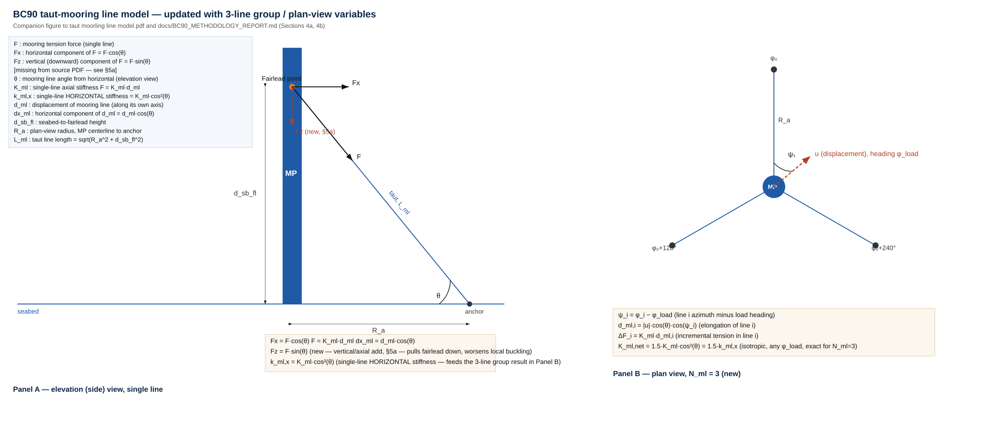

# Neretek BC90 — Concept Design Tool: Engineering Report

**Prepared by:** Concept Engineering (internal working paper, tool-generated analysis)
**Date:** 2026-07-24
**Authour:** Yusik Kim, yusik.kim.work@outlook.com / Claude Code
**Status:** Concept-stage screening only — not certification or FEED design

---

## 1. Introduction

BC90 is a fixed-bottom monopile foundation extended with a taut pre-tensioned 3-line mooring system, intended for "transitional deepwater" sites (60–90 m) where a conventional monopile becomes uneconomic and floating wind remains costly and unproven at scale. This report documents an independently built concept-design tool for BC90 — an additive extension of a developed monopile (MP) sizing tool [yusik-kim/Monopile-design](https://github.com/yusik-kim/Monopile-design) — and presents what that tool actually shows about BC90's physical behavior and quantified cost/weight benefit.

**Figure 1.** BC90 concept (source: Neretek public materials).

The tool is built from first principles against published reference-turbine designs (OC3/NREL 5 MW, DTU 10 MW, IEA 15 MW, IEA 22 MW) and DNV-style closed-form checks, not calibrated to Neretek's own design. It is a concept-screening tool, not a substitute for certification-grade or FEED-stage analysis.

All reference referred in the texts can be found from
[yusik-kim/Monopile-design](https://github.com/yusik-kim/Monopile-design).

---

## 2. Methodology

### 2.1 Baseline monopile (MP) process

The baseline tool sizes a monopile against five checks — ULS (bending/shear), SLS (mudline rotation), natural-frequency/soft-stiff avoidance (NFA), FLS (fatigue), and local shell buckling — using closed-form Hetenyi beam-on-elastic-foundation soil stiffness, Morison drag-only wave loads, and a DNV-RP-C203-style S-N fatigue curve. Geometry (diameter `D`, wall thickness `t`, embedded length `L`) starts from a rule-of-thumb guess anchored to real reference designs, then iterates: grow whichever dimension
most effectively relieves the worst-failing check, until all five checks pass; then two further passes shrink diameter, then thickness, to remove any excess margin the growth-only search leaves behind. Full equations: `docs/METHODOLOGY_REPORT.md`.

The baseline tool is verified against three real reference monopile designs (exact equations, constants and results in Appendix A.1) — diameter matches the real design to within 1% in all three cases.

### 2.2 BC90 extension

BC90 keeps every baseline equation unchanged and adds a taut 3-line mooring
system as a new load path. Concretely, per iteration:

1. Solve for the net mooring reaction force at the fairlead, given the pile's own flexibility and the mooring group's horizontal stiffness (a linear-elastic, tension-only spring model, 3 lines at 120°).
2. That reaction reduces the mudline design moment/shear the way a horizontal restraint would, but introduces a **new critical section at the fairlead** that must also be checked (mooring can move the governing location up the pile, not just relieve the mudline).
3. The mooring's vertical (pretension) component adds **axial compression** to the pile — this can make local shell buckling worse even as bending demand drops from step 2, a genuine physical trade-off, not a spreadsheet artifact.
4. Natural-frequency stiffness is corrected for the mooring's contribution as an additional spring in the flexibility chain.
5. Two checks with no baseline equivalent are added: mooring-line ULS (line tension vs. minimum breaking load) and a slack/minimum-tension check (the entire linear model stops applying once a leeward line goes slack).

Full derivations, the redundant-force solve, and every constant: `docs/BC90_METHODOLOGY_REPORT.md`.

**Figure 2.** Mooring geometry and free body (elevation + plan view, 3 lines).

---

## 3. Analysis

### 3.1 Tool verification — does BC90 reduce to MP in the limit?

As mooring stiffness and pretension both go to zero, BC90 must converge exactly to the plain monopile result — a mooring line with no stiffness and no tension exerts no force. This was tested directly (15 MW, 75 m depth, sand) and confirmed: the mooring model correctly reduces to the baseline monopile with no mooring effect.

### 3.2 Optimized cost/weight vs. water depth

A two-stage search (coarse grid + pattern-search refinement) independently re-optimizes mooring line angle, minimum breaking load (MBL), and fairlead depth **at every water depth** — not one fixed mooring design reused everywhere — and co-optimizes pile geometry at each candidate. Site: 15 MW turbine, sand (φ=34°), Hs=5.5 m, Tp=9.5 s, current=0.4 m/s, water depth swept 20–150 m in 10 m steps. Full table: Appendix A.2.

**Figure 3.** Steel weight vs. water depth, MP vs. BC90 (optimized).

**Figure 4.** Total cost vs. water depth — MP (steel only) vs. BC90 (steel + mooring line + anchors).

| Depth | MP steel | BC90 steel | Weight saved | MP cost | BC90 total cost | Cost saved | Governing |
| ----- | -------- | ---------- | ------------ | ------- | --------------- | ---------- | --------- |
| 20 m  | 1,183 t  | 1,171 t    | +1.0%        | $2.60M  | $3.33M          | **−28.1%** | FLS       |
| 50 m  | 1,475 t  | 1,451 t    | +1.6%        | $3.24M  | $3.97M          | **−22.3%** | FLS       |
| 60 m  | 1,609 t  | 859 t      | +46.6%       | $3.54M  | $3.40M          | **+4.0%**  | NFA       |
| 70 m  | 1,737 t  | 961 t      | +44.7%       | $3.82M  | $3.62M          | **+5.4%**  | NFA       |
| 90 m  | 1,999 t  | 1,181 t    | +40.9%       | $4.40M  | $4.09M          | **+6.9%**  | NFA       |
| 120 m | 2,377 t  | 1,587 t    | +33.2%       | $5.23M  | $4.93M          | **+5.7%**  | NFA       |
| 150 m | 2,875 t  | 1,864 t    | +35.1%       | $6.32M  | $5.98M          | **+5.5%**  | NFA       |

**The cost story flips between 50 m and 60 m.** Below 50 m, BC90's extra mooring line and anchor cost outweigh the steel it saves — total cost is 22–28% *higher* than the plain monopile. From 60 m up, BC90 is both lighter (33–47% less steel) and cheaper (4–7% less total CAPEX). This is broadly consistent with the 60–90 m target window in Neretek's own materials.

### 3.3 Governing utilizations across water depth

The table above names one governing check per depth. But other checks are often close to their own limit too — that is useful information the single "governing" label hides. Full utilization vectors: Appendix A.3.

| Depth | BC90 governing | Governing util. | 2nd-closest check | 2nd util. |
| ----- | -------------- | --------------- | ----------------- | --------- |
| 20 m  | FLS            | 1.000           | **NFA**           | **0.922** |
| 40 m  | FLS            | 1.000           | **Buckling**      | **0.973** |
| 50 m  | FLS            | 1.000           | **Buckling**      | **0.989** |
| 60 m  | NFA            | 1.000           | Mooring ULS       | 0.952     |
| 70 m  | NFA            | 1.000           | Mooring ULS       | 0.952     |
| 90 m  | NFA            | 1.000           | Mooring ULS       | 0.952     |
| 100 m | NFA            | 1.000           | Mooring ULS       | 0.952     |
| 150 m | NFA            | 0.999           | Mooring ULS       | 0.938     |

Two findings worth flagging beyond the single named "governing" check:

- **Buckling nearly matches FLS in the 40–50 m band** (0.97–0.99). This is the axial-compression effect of mooring pretension (§2.2, point 3) showing up quantitatively. A small change in the pretension assumption could make buckling the governing check in this band. At 60 m and above, buckling drops back to ~0.79 — this co-governing effect is specific to the low-MBL, 40–50 m band.

- **Mooring-line ULS sits at 0.90–0.95 at nearly every depth**, even though it never governs by name. The optimizer keeps sizing the mooring line close to its tension limit — the expected behavior of a cost-minimizing search. But from 60 m up, that "limit" is a line size that has never been built.

### 3.4 CAPEX breakdown: steel, mooring line, anchors

BC90's total CAPEX (§3.2) is steel + mooring line (3 lines) + anchors (3). Mooring line cost depends on MBL (`docs/misc/mooring_line_database.md` §10a), not fixed — its cost per meter varies more than 25× across the sweep because the optimizer picks a different MBL at each depth. Anchor cost is a flat, unsourced \$250,000 per anchor, the same at every depth (see Limitations). Full table: Appendix A.3.

| Depth | Steel cost | Mooring line (3 lines) | Line $/m (single) | Anchors (3) | Total CAPEX |
| ----- | ---------- | ---------------------- | ----------------- | ----------- | ----------- |
| 20 m  | $2.58M     | $8k                    | $87/m             | $0.75M      | $3.33M      |
| 50 m  | $3.19M     | $24k                   | $131/m            | $0.75M      | $3.97M      |
| 60 m  | $1.89M     | $758k                  | $2,993/m          | $0.75M      | $3.40M      |
| 70 m  | $2.11M     | $753k                  | $2,304/m          | $0.75M      | $3.62M      |
| 90 m  | $2.60M     | $744k                  | $1,950/m          | $0.75M      | $4.09M      |
| 120 m | $3.49M     | $689k                  | $1,354/m          | $0.75M      | $4.93M      |
| 150 m | $4.10M     | $1,127k                | $1,838/m          | $0.75M      | $5.98M      |

**Below ~50 m, anchors dominate the added cost, not the mooring line.** At 20 m, the 3 anchors (\$0.75M) cost about 90× the mooring line itself (\$8k). This is why the cost story (§3.2) turns negative before the weight story does: a short, low-MBL line is nearly free, but the flat anchor cost is not. **At 60 m, the mooring line cost (\$758k) already exceeds the flat anchor cost (\$750k)** — a jump from the sub-\$30k line cost at 50 m, driven entirely by the shift to a 200 MN MBL line, which has no manufacturing precedent (§4 Limitations item 1). From 60 m up, steel cost also drops sharply, since the pile shrinks once a large mooring line does real work — this produces the modest CAPEX saving in §3.2. But every 60 m+ mooring-line cost is a cost formula stretched far past any real line, not a real price. **The anchor cost placeholder is the input most likely to change the low-depth result**, if replaced with a holding-capacity-based figure (see Limitations).

### 3.5 Benchmark: real monopile mass/diameter, water depth < 50 m

A real 15 MW-class monopile (He Dreiht, Germany, V236-15MW turbines, ~38–41 m water depth) has a steel mass of ~1,350 t — close to this tool's own 40 m prediction of 1,352 t (Offshore Wind Biz / EnBW, 2024–25). No public source gives a steel-only cost figure at this detail for a named project, so cost cannot be benchmarked the same way.

### 3.6 Benchmark: floating wind foundation CAPEX, water depth 70–150 m

A sourced floating-wind cost (steel platform + mooring system, BVG Associates / ORE Catapult, *Guide to a Floating Offshore Wind Farm*, 2023 ed., cross-checked against `docs/misc/mooring_line_database.md` §10) is **≈\$2.25M/MW** for a 15 MW turbine at **100 m** water depth. This tool's own BC90 result at the same depth is **≈\$291,880/MW** (materials only) — about 7.7× lower, though not a fair comparison, since the floating figure includes fabrication and installation and BC90's does not. This supports the idea that BC90's **60–100 m** target window sits below the depth range where floating wind's real-world cost applies.

---

## 4. Limitations and Opportunities

### Limitations

1. **Manufacturability of the applied MBL is not considered by the tool.** The known practical limit for a single polyester line is around 25 MN (Goliat FPSO, Lankhorst Gama 98 rope). Several of §3.2's favorable-depth results use MBL above this limit (Appendix A.2) — a multi-line-per-mooring-point setup would likely be needed there, which the current model does not include.
2. **NFA governs the entire favorable BC90 depth range (60–150 m in §3.2).** The derivation is mathematical and uses the same equations and modeling approach as the baseline MP tool — this is not a limitation specific to the BC90 extension. As with the MP tool, NFA's driving accuracy and the model's uncertainties are worth improving, and doing so would meaningfully raise confidence in this range given how much of BC90's benefit sits here.
3. Mooring line is modeled as a linear-elastic, tension-only spring — no slack/catenary nonlinearity, and no fatigue check on the mooring line or fairlead connection.
4. Mooring pretension's axial-compression effect on buckling is modeled, but rests on assumptions (3 lines, 120° spacing, equal pretension) not derived from a site-specific design.
5. The cost model covers CAPEX and materials only — no installation, no anchor holding-capacity dependence, no OPEX (mooring inspection, re-tensioning, replacement). The mooring-line cost *formula* itself is only sourced up to MBL≈30 MN — every 60 m+ line-cost figure is an extrapolation, not a quoted or plausible price.
6. One representative site (single soil type, single sea state) — not validated against any named real location.
7. Pile geometry and mooring layout are optimized as **two nested loops**, not one joint search. This likely leaves some benefit unclaimed (a similar nested-search limitation elsewhere in this codebase left ~2% on the table in one case).
8. No accidental-limit-state (ALS) check for losing one mooring line — a real gap for a design positioned as ready for near-term deployment.

### Opportunities

1. **Cap the MBL search at a buildable size (~25–30 MN, per §4 item 1), or model multiple parallel lines/anchors per mooring point as the lever for extra capacity.** This is the highest-priority next step — it would turn §3.2's results into numbers that describe buildable hardware, not a cost-surface exploration.
2. Independently verify the NFA formula against a real reference design or a higher-fidelity (coupled, multi-spring) model.
3. Source real mooring-line data (cost, breaking load, stiffness) from a manufacturer, in the ~10–30 MN range this tool's own scope actually targets.
4. Extend the cost model to installation, holding-capacity-dependent anchor sizing (replacing the flat \$250,000/anchor placeholder — §3.4), and OPEX, for a genuine CAPEX/LCOE comparison.
5. Once item 1 gives it a buildable basis, re-run the optimized sweep across more sites/soil types to test how site-sensitive the ~50–60 m cost break-even point is.
6. Resolve the mooring-redundancy design philosophy and add the ALS mooring-loss case.
7. Move to a joint (not nested) pile+mooring optimization.

---

## 5. Summary

- **The physics is internally consistent.** BC90 correctly reduces to the plain monopile in the no-mooring limit (verified to 5–6 significant figures), and every mooring effect uses the same equations as the baseline monopile tool.
- **The benefit is real, but fabricability of mooring lines to be checked..** In the 60–150 m range, optimized BC90 is 33–47% lighter in steel and 4–7% cheaper in total CAPEX than an equally-optimized monopile at the same site — but every depth in that range needs a mooring-line MBL of 90–200 MN, 3×–8× beyond the limit of single line polyester rope  (≈25.3 MN; §4 item 1). Below 50 m, BC90 is currently *more* expensive under this model, mainly due to the flat per-anchor cost placeholder (§3.4), not steel.
- **Steel mass/diameter matches a real project well.** At 40 m, this tool's 15 MW result (10.0 m, 1,352 t) is close to He Dreiht's built V236-15MW monopiles (~39 m, 9.2 m, ~1,350 t) — genuinely supportive, though not a controlled validation. **No public source allows the same check on cost** — steel-material-only \$/tonne is not disclosed for any named built project (§3.5).
- **Against floating wind specifically, the gap is large but not yet apples-to-apples.** At 100 m, this tool's own BC90 CAPEX (~\$292k/MW, materials only) is ~7.7× below a sourced steel-platform-plus-mooring floating-wind benchmark (~\$2.25M/MW, BVG Associates/ORE Catapult 2023, fabrication- and installation-inclusive) — directionally favorable and traceable on both sides, but not cost-scope-matched until BC90's own fabrication/installation cost is modeled (§3.6).

---

## Appendix

### A.1 Baseline (MP) verification cases

| Case                    | Result                          | Governing | vs. real reference                             |
| ----------------------- | ------------------------------- | --------- | ---------------------------------------------- |
| 5 MW, 20 m, sand φ=36°  | D=6.00 m, t=64.5 mm, L=30.0 m   | FLS       | Matches OC3/NREL 5 MW diameter (6.0 m) exactly |
| 15 MW, 35 m, sand φ=35° | D=10.00 m, t=106.9 mm, L=50.0 m | FLS       | Matches IEA 15 MW diameter (10.0 m) exactly    |
| 22 MW, 34 m, sand φ=36° | D=10.10 m, t=114.4 mm, L=64.0 m | FLS       | Within 1% of IEA 22 MW diameter (10.0 m)       |

### A.2 Full water-depth sweep (15 MW, sand φ=34°, Hs=5.5 m, Tp=9.5 s, current=0.4 m/s)

**MBL above 30 MN (marked \*) has no manufacturing precedent — see §4 Limitations item 1.**

| Depth (m) | MP D (m) | MP mass (t) | MP cost | BC90 D (m) | BC90 mass (t) | BC90 cost | Weight saved | Cost saved | θ (deg) | MBL (MN) | Fairlead (×depth) | Governing |
| --------- | -------- | ----------- | ------- | ---------- | ------------- | --------- | ------------ | ---------- | ------- | -------- | ----------------- | --------- |
| 20        | 10.00    | 1,183       | $2.60M  | 9.90       | 1,171         | $3.33M    | +1.0%        | −28.1%     | 43.1    | 5        | 1.00              | FLS       |
| 30        | 10.00    | 1,256       | $2.76M  | 10.00      | 1,232         | $3.50M    | +1.9%        | −26.8%     | 36.2    | 18       | 1.00              | FLS       |
| 40        | 10.00    | 1,352       | $2.98M  | 10.00      | 1,328         | $3.68M    | +1.8%        | −23.7%     | 41.6    | 5        | 0.55              | FLS       |
| 50        | 9.70     | 1,475       | $3.24M  | 9.70       | 1,451         | $3.97M    | +1.6%        | −22.3%     | 50.0    | 8        | 0.94              | FLS       |
| 60        | 9.40     | 1,609       | $3.54M  | 5.30       | 859           | $3.40M    | +46.6%       | +4.0%      | 45.3    | 200\*    | 1.00              | NFA       |
| 70        | 9.25     | 1,737       | $3.82M  | 5.45       | 961           | $3.62M    | +44.7%       | +5.4%      | 40.0    | 153.75\* | 1.00              | NFA       |
| 80        | 9.10     | 1,860       | $4.09M  | 5.60       | 1,079         | $3.83M    | +42.0%       | +6.3%      | 41.2    | 130\*    | 1.00              | NFA       |
| 90        | 8.95     | 1,999       | $4.40M  | 5.65       | 1,181         | $4.09M    | +40.9%       | +6.9%      | 45.0    | 130\*    | 1.00              | NFA       |
| 100       | 8.80     | 2,130       | $4.69M  | 6.00       | 1,367         | $4.38M    | +35.8%       | +6.6%      | 40.9    | 90\*     | 1.00              | NFA       |
| 110       | 8.80     | 2,234       | $4.91M  | 5.80       | 1,387         | $4.64M    | +37.9%       | +5.5%      | 50.0    | 130\*    | 1.00              | NFA       |
| 120       | 8.65     | 2,377       | $5.23M  | 6.15       | 1,587         | $4.93M    | +33.2%       | +5.7%      | 45.0    | 90\*     | 1.00              | NFA       |
| 130       | 8.50     | 2,532       | $5.57M  | 5.70       | 1,583         | $5.25M    | +37.5%       | +5.8%      | 45.0    | 122.5\*  | 1.00              | NFA       |
| 140       | 8.35     | 2,699       | $5.94M  | 5.55       | 1,664         | $5.64M    | +38.3%       | +4.9%      | 50.0    | 150\*    | 1.00              | NFA       |
| 150       | 8.20     | 2,875       | $6.32M  | 5.70       | 1,864         | $5.98M    | +35.1%       | +5.5%      | 47.2    | 122.5\*  | 1.00              | NFA       |

Source: `bc90/water_depth_sweep_results.csv`, reproducible via `bc90/sweep_water_depth_cost.py` (MBL search bound 5–300 MN — see `bc90/misc/optimize_min_cost.py` and §4 Limitations item 1).

### A.3 Full utilization and cost breakdown by water depth

(§3.3/§3.4 source data — `bc90/misc/water_depth_sweep_detail.csv`, reproducible via `bc90/misc/sweep_water_depth_detail.py`)

| Depth | BC90 ULS | SLS   | NFA   | FLS   | Buck  | Moor.ULS | Slack | Steel $ | Line $  | Line $/m | Anchors $ | Total $ |
| ----- | -------- | ----- | ----- | ----- | ----- | -------- | ----- | ------- | ------- | -------- | --------- | ------- |
| 20    | 0.249    | 0.077 | 0.922 | 1.000 | 0.581 | 0.902    | 0.051 | $2.58M  | $8k     | $87      | $0.75M    | $3.33M  |
| 30    | 0.249    | 0.077 | 0.895 | 1.000 | 0.805 | 0.902    | 0.051 | $2.71M  | $43k    | $280     | $0.75M    | $3.50M  |
| 40    | 0.249    | 0.079 | 0.869 | 1.000 | 0.973 | 0.902    | 0.051 | $2.92M  | $9k     | $87      | $0.75M    | $3.68M  |
| 50    | 0.249    | 0.082 | 0.840 | 1.000 | 0.989 | 0.903    | 0.051 | $3.19M  | $24k    | $131     | $0.75M    | $3.97M  |
| 60    | 0.562    | 0.083 | 1.000 | 0.653 | 0.786 | 0.952    | 0.055 | $1.89M  | $758k   | $2,993   | $0.75M    | $3.40M  |
| 70    | 0.490    | 0.089 | 1.000 | 0.679 | 0.719 | 0.952    | 0.055 | $2.11M  | $753k   | $2,304   | $0.75M    | $3.62M  |
| 80    | 0.425    | 0.094 | 1.000 | 0.731 | 0.706 | 0.953    | 0.055 | $2.37M  | $710k   | $1,950   | $0.75M    | $3.83M  |
| 90    | 0.386    | 0.087 | 1.000 | 0.547 | 0.690 | 0.952    | 0.055 | $2.60M  | $744k   | $1,950   | $0.75M    | $4.09M  |
| 100   | 0.314    | 0.107 | 1.000 | 0.924 | 0.684 | 0.952    | 0.056 | $3.01M  | $620k   | $1,354   | $0.75M    | $4.38M  |
| 110   | 0.322    | 0.080 | 0.999 | 0.378 | 0.674 | 0.948    | 0.055 | $3.05M  | $840k   | $1,950   | $0.75M    | $4.64M  |
| 120   | 0.265    | 0.095 | 1.000 | 0.617 | 0.671 | 0.948    | 0.056 | $3.49M  | $689k   | $1,354   | $0.75M    | $4.93M  |
| 130   | 0.290    | 0.060 | 1.000 | 0.150 | 0.566 | 0.942    | 0.055 | $3.48M  | $1,014k | $1,838   | $0.75M    | $5.25M  |
| 140   | 0.286    | 0.045 | 1.000 | 0.061 | 0.525 | 0.938    | 0.055 | $3.66M  | $1,232k | $2,248   | $0.75M    | $5.64M  |
| 150   | 0.250    | 0.055 | 0.999 | 0.099 | 0.490 | 0.938    | 0.055 | $4.10M  | $1,127k | $1,838   | $0.75M    | $5.98M  |

For reference, the MP (no-mooring) baseline's own governing check is FLS at every depth in this sweep, utilization 0.945–0.994 (by design — the baseline's shrink loop also stops at the governing check's ≈1.0 boundary).

### A.4 Key equations (full derivations: `docs/BC90_METHODOLOGY_REPORT.md`)

**Net mooring reaction** (redundant-force solve at the fairlead): `F_ml = δ_fl,0 / (f_aa + 1/K_ml,net)`, where `δ_fl,0` is the unrestrained fairlead deflection under thrust+wave loads, `f_aa` is the pile's own flexibility at the fairlead, and `K_ml,net` is the 3-line group horizontal stiffness.

**Net mudline moment/shear:** `M_char,net = M_char − F_ml·d_sb,fl`, `V_char,net = V_char − F_ml`; fairlead-section moment `M_fl = M_char − d_sb,fl·V_char`.

**Vertical (axial) mooring load:** `Fz = N_ml·T0·sin(θ)`, added directly to the pile's self-weight axial load feeding the buckling check.

**Mooring line cost** (polyester, sourced 2026-07-24, `docs/misc/mooring_line_database.md` §10a): `cost/m [EUR] = 13.8·MBL_MN + 11.28`; anchor cost is an unsourced \$250,000/line placeholder. This formula is only sourced up to MBL≈30 MN — every §3.2/A.2 result above 30 MN (all of 60–150 m) is an extrapolation past the source paper's own validated range **and past any polyester line ever manufactured** (see §4 Limitations item 1).

### A.5 Source list

- `docs/METHODOLOGY_REPORT.md` — full baseline (MP) methodology, equations, constants, verification.
- `docs/BC90_METHODOLOGY_REPORT.md` — full BC90 methodology, equations, constants, assumptions.
- `docs/misc/mooring_line_database.md` — sourced mooring line/anchor cost and property research, including the "Physical-precedent caveat" behind §4 Limitations item 1.
- `bc90/sweep_water_depth_cost.py`, `bc90/water_depth_sweep_results.csv` — the optimization sweep in §3.2/A.2, reproducible directly.
- `bc90/misc/optimize_min_cost.py` — the per-depth cost optimizer §3.2 calls (MBL search bound 5–300 MN).
- `bc90/misc/sweep_water_depth_detail.py`, `bc90/misc/water_depth_sweep_detail.csv` — the utilization/cost breakdown in §3.3/§3.4/A.3, reproducible directly.
- `bc90/misc/plot_depth_sweep_figures.py` — generates Figures 3 and 4 from `water_depth_sweep_results.csv`.
- `bc90/misc/mbl300_spotcheck_60_70m.py` — spot-check script for the 60/70 m results at the current MBL bound.
- Mooring-line manufacturing precedent (§4 Limitations item 1): offshore-mag.com, "Polyester ropes offer new opportunities for deepwater development" and "An examination of polyester fiber taut leg mooring systems for deepwater" (Chevron Tahiti, ≈18.7 MN); Lankhorst Ropes coverage via maritime-executive.com, "Lankhorst Ropes at OTC 2014" (Goliat FPSO, ≈25.3 MN, largest Gama 98 rope to date); lankhorstoffshore.com news, "Lankhorst offshore mooring lines for the Energean Power FPSO" (12.4 MN).
- Industrial monopile benchmark (§3.5): Offshore Wind Biz coverage of He Dreiht (EnBW, 2024–25) and Sofia/Dogger Bank A/B/C (RWE/Equinor, 2024); BVG Associates, "Guide to an Offshore Wind Farm," generic 15 MW/40 m monopile cost case (current edition, guidetoanoffshorewindfarm.com).
- Floating wind CAPEX benchmark (§3.6): BVG Associates / ORE Catapult, "Guide to a Floating Offshore Wind Farm" (2023 edition, guidetofloatingoffshorewind.com) — steel platform cost items and, cross-checked against `docs/misc/mooring_line_database.md` §10, the mooring lines/anchors/jewellery/pre-installation cost items; NREL/UMaine, "Cost of Floating Offshore Wind Energy Using New England Aqua Ventus" (NREL/TP-5000-75618, Jan 2020) for the secondary concrete-substructure cross-check.
- `Extend_MP_BC90.md` — original scope brief this tool was built against.
